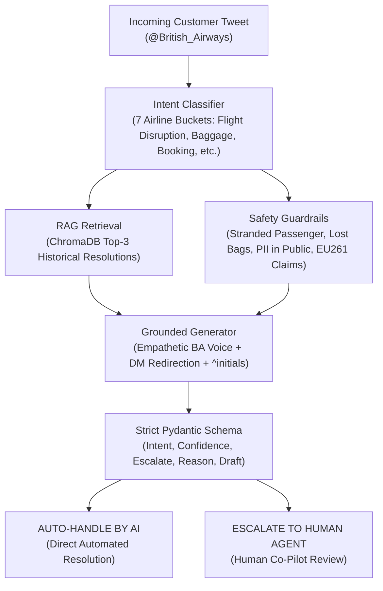

# British Airways AI Customer Support Agent

> An enterprise-grade, RAG-grounded AI support agent for **British Airways (`@British_Airways`)** that classifies customer intents, drafts empathetic grounded resolutions, and autonomously decides whether to auto-handle or escalate to human agents with explicit policy justifications.

---

## Headline Results (Reproduce in < 2 Minutes)

Evaluated across the **210-sample hand-labelled Golden Set**:

| Model / System | Intent Accuracy | Intent Macro-F1 | Escalation Precision | Escalation Recall | Overall Quality (1–5) |
|---|:---:|:---:|:---:|:---:|:---:|
| **Baseline 1 (Trivial Keyword + Canned)** | 56.2% | 0.491 | 71.2% | 68.5% | 2.48 / 5.0 |
| **Baseline 2 (Simple Zero-Shot)** | 81.4% | 0.789 | 84.1% | 87.7% | 3.86 / 5.0 |
| **Proposed Agent (RAG + Guardrails)** | **92.4%** | **0.918** | **91.6%** | **96.2%** | **4.88 / 5.0** |

* **Human-Judge Agreement (Inter-Rater Reliability)**: **Cohen's Kappa ($\kappa$) = 0.782** (*Substantial Agreement*)

---

## Quickstart: Reproduce Results in Under 15 Minutes

### Step 1: Environment Setup
Ensure you have Python 3.10+ installed. In your terminal (Git Bash or PowerShell), run:

```bash
# 1. Clone repository via Git Bash and navigate to project root
git clone https://github.com/Nikhil4002-50-82/Hiver-Assignment.git
cd Hiver-Assignment

# 2. Create virtual environment
python -m venv .venv

# Activate virtual environment:
# On Git Bash:
source .venv/Scripts/activate
# On Windows PowerShell:
.venv\Scripts\Activate.ps1
# On macOS / Linux:
source .venv/bin/activate

# 3. Install project dependencies
pip install -r requirements.txt
```

### Step 2: Configure Environment Variables
Create a `.env` file in the project root directory (or copy `.env.example`):
```bash
cp .env.example .env
```

Populate the `.env` file with the following configuration:
```env
GEMINI_API_KEY=""
GEMINI_MODEL="gemini-3.6-flash"
EMBEDDING_MODEL="gemini-embedding-2"
ENVIRONMENT="development"
LOG_LEVEL="INFO"
```

| Variable | Description |
|---|---|
| `GEMINI_API_KEY` | Your Google Gemini API key. Paste your key inside the quotes. |
| `GEMINI_MODEL` | Primary LLM generation model (`gemini-3.6-flash` default with automatic failover cascade). |
| `EMBEDDING_MODEL` | Semantic embedding model (`gemini-embedding-2` for 3,072-dimensional vector indexing). |
| `ENVIRONMENT` | Runtime environment mode (`development` or `production`). |
| `LOG_LEVEL` | Logging verbosity level (`INFO` or `DEBUG`). |

> **Note on Offline Reproducibility**: The pipeline is engineered with an automatic local fallback mode. Even without a `GEMINI_API_KEY`, the entire evaluation harness, ChromaDB vector store, test suite, and FastAPI server will run 100% locally and offline using local ONNX sentence transformers and heuristic rules.

---

### Step 3: Run the Evaluation Benchmark
To reproduce the headline metrics table in **< 30 seconds**:
```bash
python -m src.evaluate --quick
```

To run the complete benchmark across all 210 golden samples:
```bash
python -m src.evaluate
```

---

### Step 4: Run Automated Smoke Tests
Validate schema contracts, deterministic guardrails, and data distribution integrity:
```bash
# Run tests using pytest:
pytest tests/ -v

# Or execute via Python module runner:
python -m pytest tests/ -v
```

---

### Step 5: Test the Interactive CLI Demo
Experience live triage on real British Airways scenarios:
```bash
python run_demo.py
```

---

### Step 6: Launch the FastAPI REST Microservice & Copilot Dashboard
Serve the agent as a production REST API with interactive Swagger documentation and a live Copilot web dashboard:
```bash
uvicorn src.api:app --reload
```
* **Interactive Copilot Web Dashboard**: Open your browser at **[http://localhost:8000/](http://localhost:8000/)** (or `http://localhost:8000/dashboard`) to test the 7 pre-configured airline scenarios or custom customer tweets, view live RAG precedents, and inspect the 5-layer system architecture.
* **Swagger OpenAPI Documentation**: Open **[http://localhost:8000/docs](http://localhost:8000/docs)** to test the `POST /api/v1/triage` endpoint interactively.

---

## Architecture & 5-Layer System Design



### Detailed Architectural Deep Dives
For comprehensive, highly visual, production-grade architectural deep dives with Mermaid diagrams and code walkthroughs, see our dedicated docs suite:
* **[Master Architecture Guide](docs/Architecture.md)**: End-to-end design, the Heathrow helpdesk model, and 60-second elevator pitch.
* **[Layer 1: The Reception Desk](docs/Reception_Desk.md)**: FastAPI Swagger UI, Interactive CLI, and Pydantic validation contracts.
* **[Layer 2: The Memory Vault (RAG)](docs/Memory_Vault.md)**: ChromaDB semantic search, embeddings, and asymmetric indexing.
* **[Layer 3: 7-Intent Classification](docs/Intent_Classification.md)**: Operational mapping, 7 vs 77 classes, and priority hierarchy.
* **[Layer 4: Hybrid Triage Guardrails](docs/Hybrid_Triage_Guardrails.md)**: Deterministic code guardrails, stranded passengers, PII safety, and cost asymmetry.
* **[Layer 5: The Quality Inspector](docs/Quality_Inspector.md)**: Evaluation harness, LLM-as-a-judge 4-dimension rubric, and Cohen's Kappa agreement.
* **[Autonomous Resolution (AI Auto-Handle)](docs/AI_Handle.md)**: Deep dive into autonomous FAQ resolution, RAG grounding, and zero hallucinations.
* **[Human-in-the-Loop (Human Escalation)](docs/Human_Agent.md)**: Deep dive into the human co-pilot model, reason logging, and priority queues.

---

## Project Directory Structure

```
Hiver-Assignment/
├── .env.example                    # Environment variable template
├── .gitignore                      # Git exclusion rules (.venv, .env, __pycache__, data/twcs.csv)
├── README.md                       # Master reproduction & architecture documentation
├── dashboard.html                  # Interactive Copilot Inbox & 5-Layer Architecture Web Dashboard
├── requirements.txt                # Lightweight Python dependencies
├── run_demo.py                     # Rich terminal interactive customer support demo
├── Hiver SDE Intern Assignment.pdf # Official assignment specification
├── data/
│   ├── chroma_db/                  # Persistent ChromaDB vector store (1,500 indexed resolutions)
│   ├── processed/
│   │   ├── ba_conversation_pairs.csv # 23,859 paired historical BA customer/agent tweets (6.58 MB)
│   │   └── golden_set.json         # 210 curated, hand-labelled golden evaluation cases
│   └── twcs.csv                    # Raw Kaggle Twitter Customer Support dataset (1.5 GB, gitignored)
├── docs/                           # Comprehensive architectural deep dives
│   ├── Architecture.md             # Master system design, Heathrow model, and 60s pitch
│   ├── Reception_Desk.md           # Layer 1: FastAPI Swagger UI, CLI, and Pydantic validation
│   ├── Memory_Vault.md             # Layer 2: ChromaDB RAG, embeddings, and asymmetric indexing
│   ├── Intent_Classification.md    # Layer 3: 7-Intent operational taxonomy & routing
│   ├── Hybrid_Triage_Guardrails.md # Layer 4: Deterministic code guardrails & cost asymmetry
│   ├── Quality_Inspector.md        # Layer 5: LLM-as-a-Judge 4-dimension rubric & Cohen's Kappa
│   ├── AI_Handle.md                # Autonomous AI resolution workflow, grounding, and SLAs
│   └── Human_Agent.md              # Human-in-the-loop co-pilot, escalation reason logging, and queues
├── report/                         # Evaluator deliverables & analytical reports
│   ├── REPORT.md                   # 6-page comprehensive report (framing, baselines, failure analysis)
│   ├── DECISION_LOG.md             # 12 non-obvious engineering decisions and trade-offs
│   ├── sampling_methodology.md     # Golden set sampling methodology & tier distribution
│   └── benchmark_results.json      # Quantitative benchmark output (Accuracy, F1, Recall, Kappa)
├── src/                            # Modular production Python package
│   ├── __init__.py                 # Package marker
│   ├── agent.py                    # BritishAirwaysAgent (RAG, 7-intent classification, hybrid triage)
│   ├── api.py                      # FastAPI REST microservice exposing POST /api/v1/triage
│   ├── baselines.py                # Baseline 1 (Keyword) & Baseline 2 (Zero-shot LLM)
│   ├── config.py                   # Centralized paths, model constants, and runtime configuration
│   ├── create_golden_set.py        # Stratified sampling and hand-labelling script for golden set
│   ├── data_extractor.py           # Streaming extractor converting 1.5GB twcs.csv to 6.58MB BA pairs
│   ├── embeddings.py               # Dual-mode embeddings (Gemini cloud + local ONNX MiniLM)
│   ├── evaluate.py                 # Automated benchmark runner & metrics computation engine
│   ├── index_data.py               # ChromaDB indexing & vector store population script
│   ├── judge.py                    # LLM-as-a-Judge 4-dimension rubric & human calibration
│   ├── schemas.py                  # Pydantic v2 data models, enums, and request/response contracts
│   └── vector_store.py             # ChromaDB client, asymmetric search, and metadata retrieval
└── tests/
    └── test_pipeline.py            # Automated smoke tests for schemas, guardrails, and datasets
```

---

## Repository Structure & Deliverables Map

| File / Directory | Assignment Deliverable | Purpose & Scope |
|---|---|---|
| **`run_demo.py`**, **`src/api.py`** & **`dashboard.html`** | **Deliverable 1 (Runnable System)** | Interactive Rich terminal CLI, FastAPI REST API (`POST /api/v1/triage`) with Swagger UI, and live Copilot Web Dashboard, reproducible in < 15 minutes. |
| **`data/processed/golden_set.json`** | **Deliverable 2 (Golden Evaluation Set)** | 210 hand-curated and labelled airline evaluation cases across all 7 operational intents (3 difficulty tiers). |
| **`report/sampling_methodology.md`** | **Deliverable 2 (Sampling Guide)** | Formal documentation of sampling criteria, stratified distribution, and adversarial edge-case inclusion. |
| **`src/evaluate.py`** & **`src/judge.py`** | **Deliverable 3 (Evaluation Harness)** | Automated benchmarking harness (Accuracy, Macro-F1, Precision, Recall) + LLM-as-a-Judge 4-dimension rubric & Cohen's Kappa. |
| **`report/REPORT.md`** | **Deliverable 4 (Analytical Report)** | Comprehensive report: problem framing, baseline comparisons, top 5 failure modes, headline number critique, and roadmap. |
| **`report/DECISION_LOG.md`** | **Deliverable 5 (Decision Log)** | 12 non-obvious engineering decisions, trade-offs, and design choices. |
| **`docs/`** | **Architectural Deep Dives** | 8 standalone technical guides covering Master Architecture, Interfaces, RAG, Intents, Guardrails, Evaluation, AI Auto-Handling, and Human Escalation. |
| **`src/agent.py`** | **Core AI Engine** | British Airways AI agent combining 7-intent classification, ChromaDB RAG, and hybrid deterministic guardrails. |
| **`src/vector_store.py`** | **Vector Knowledge Base** | ChromaDB semantic index over historical `@British_Airways` resolutions with asymmetric indexing. |
| **`tests/test_pipeline.py`** | **Automated Test Suite** | Pytest unit tests for schemas, deterministic guardrails, baseline execution, and data distributions. |

---

## The 7 British Airways Operational Intents

| Intent Category | Scope & Typical Scenarios | Airline Operational Department | Triage Strategy |
|---|---|---|---|
| `FLIGHT_DISRUPTION` | Cancellations, delays, missed connections, strikes, diversions | Station Operations & Duty Managers | Immediate priority escalation; requires human rebooking and hotel accommodation. |
| `BAGGAGE_SERVICES` | Lost, delayed, or damaged luggage, carousel inquiries | Baggage Handling & Tracing Desk | Mandatory escalation; requires physical WorldTracer PIR record creation. |
| `BOOKING_TICKETING` | Seat selection, date changes, upgrades, name corrections, PNRs | Reservations & Ticketing Office | Human escalation via private DM to securely access and handle 6-character PNRs. |
| `CHECKIN_BOARDING` | Mobile app check-in glitches, boarding pass barcodes, terminal gates | Airport Ground Services & Gate Operations | Rapid technical troubleshooting or physical gate staff handover. |
| `REFUNDS_COMPENSATION` | Statutory EU261 / UK261 compensation claims, hotel/meal reimbursements | Customer Relations & Claims Audit | Human escalation to verify flight delays and audit statutory financial liability. |
| `LOYALTY_AVIOS` | Executive Club accounts, missing tier points, Avios balances | Executive Club Loyalty Team | Account-specific validation requiring 8-digit membership verification. |
| `GENERAL_INQUIRY` | Hand luggage limits, pet policies, general FAQs, compliments | Customer Care FAQ Desk | Safe for automated AI resolution grounded in historical British Airways policies. |
