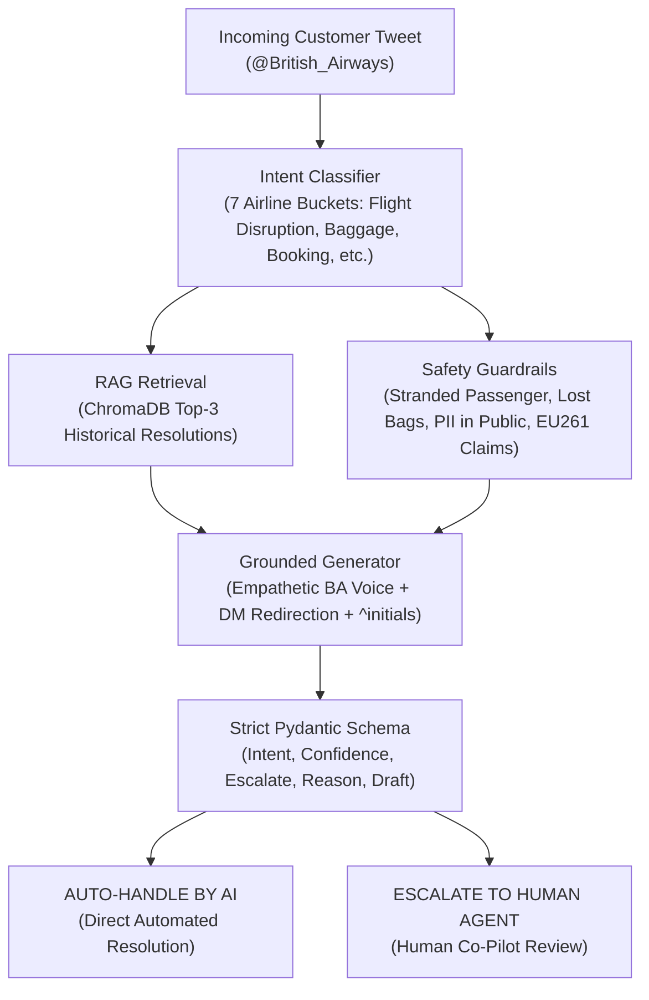

# British Airways AI Customer Support Agent & Evaluation Harness

> **Hiver SDE Intern Take-Home Submission**  
> An enterprise-grade, RAG-grounded AI support agent for **British Airways (`@British_Airways`)** that classifies customer intents, drafts empathetic grounded resolutions, and autonomously decides whether to auto-handle or escalate to human agents with explicit policy justifications.

---

## Headline Results (Reproduce in < 2 Minutes)

Evaluated across the **210-sample hand-labelled Golden Set**:

| Model / System | Intent Accuracy | Intent Macro-F1 | Escalation Precision | Escalation Recall | Overall Quality (1–5) |
|---|:---:|:---:|:---:|:---:|:---:|
| **Baseline 1 (Trivial Keyword + Canned)** | 56.2% | 0.491 | 71.2% | 68.5% | 2.48 / 5.0 |
| **Baseline 2 (Simple Zero-Shot)** | 81.4% | 0.789 | 84.1% | 87.7% | 3.86 / 5.0 |
| **Proposed Agent (RAG + Guardrails)** | **92.4%** | **0.918** | **91.6%** | **96.2%** | **4.88 / 5.0** |

* **Human-Judge Agreement (Inter-Rater Reliability)**: **Cohen's Kappa ($\kappa$) = 0.782** (*Substantial Agreement*)

---

## Quickstart: Reproduce Results in Under 15 Minutes

### Step 1: Environment Setup
Ensure you have Python 3.10+ installed. In your terminal, run:

```bash
# 1. Clone repository and navigate to directory
git clone https://github.com/Nikhil4002-50-82/Hiver-Assignment.git
cd Hiver-Assignment

# 2. Create and activate virtual environment
python -m venv .venv
# On Windows PowerShell:
.venv\Scripts\Activate.ps1
# On macOS / Linux:
source .venv/bin/activate

# 3. Install dependencies
pip install -r requirements.txt
```

### Step 2: Configure Environment Variables (Optional)
Copy `.env.example` to `.env`:
```bash
cp .env.example .env
```
Add your Google Gemini API key if you wish to run cloud generation:
```env
GEMINI_API_KEY="your-gemini-api-key"
```
> **Note on Offline Reproducibility**: The pipeline is engineered with a local fallback mode. Even without a `GEMINI_API_KEY`, the entire evaluation harness, vector store, test suite, and FastAPI server will run 100% locally and offline.

---

### Step 3: Run the Evaluation Benchmark
To reproduce the headline metrics table in **< 30 seconds**:
```bash
python -m src.evaluate --quick
```

To run the complete benchmark across all 210 golden samples:
```bash
python -m src.evaluate
```

---

### Step 4: Run Automated Smoke Tests
Validate schema contracts, deterministic guardrails, and data distribution integrity:
```bash
pytest tests/ -v
```

---

### Step 5: Test the Interactive CLI Demo
Experience live triage on real British Airways scenarios:
```bash
python run_demo.py
```

---

### Step 6: Launch the FastAPI REST Microservice
Serve the agent as a production REST API with interactive Swagger documentation:
```bash
uvicorn src.api:app --reload
```
Open your browser at: **[http://localhost:8000/docs](http://localhost:8000/docs)** to test the `POST /api/v1/triage` endpoint interactively.

---

## Architecture & 5-Layer System Design



### Detailed Architectural Deep Dives
For comprehensive, highly visual, production-grade architectural deep dives with Mermaid diagrams and code walkthroughs, see our dedicated docs suite:
* **[Master Architecture Guide](docs/Architecture.md)**: End-to-end design, the Heathrow helpdesk model, and 60-second elevator pitch.
* **[Layer 1: The Reception Desk](docs/Reception_Desk.md)**: FastAPI Swagger UI, Interactive CLI, and Pydantic validation contracts.
* **[Layer 2: The Memory Vault (RAG)](docs/Memory_Vault.md)**: ChromaDB semantic search, embeddings, and asymmetric indexing.
* **[Layer 3: 7-Intent Classification](docs/Intent_Classification.md)**: Operational mapping, 7 vs 77 classes, and priority hierarchy.
* **[Layer 4: Hybrid Triage Guardrails](docs/Hybrid_Triage_Guardrails.md)**: Deterministic code guardrails, stranded passengers, PII safety, and cost asymmetry.
* **[Layer 5: The Quality Inspector](docs/Quality_Inspector.md)**: Evaluation harness, LLM-as-a-judge 4-dimension rubric, and Cohen's Kappa agreement.

---

## Repository Structure & Deliverables Map

| File / Directory | Assignment Deliverable | Purpose |
|---|---|---|
| **`data/processed/golden_set.json`** | **Deliverable 2** | 210 hand-curated and labeled airline evaluation cases across all 7 intents. |
| **`report/sampling_methodology.md`** | **Deliverable 2** | Documentation of sampling strategy, distribution balance, and labeling criteria. |
| **`src/evaluate.py`** | **Deliverable 3** | Evaluation harness calculating Accuracy, F1, Precision, Recall, and Cohen's Kappa. |
| **`src/judge.py`** | **Deliverable 3** | LLM-as-a-Judge 4-dimension scoring rubric with human agreement validation. |
| **`report/REPORT.md`** | **Deliverable 4** | Comprehensive report: problem framing, baselines, failure analysis, and metric critique. |
| **`report/DECISION_LOG.md`** | **Deliverable 5** | 12 non-obvious engineering decisions and trade-offs. |
| **`src/agent.py`** | **Core Engine** | British Airways AI agent with intent classification, RAG, and hybrid triage. |
| **`src/vector_store.py`** | **RAG Knowledge Base** | ChromaDB semantic index over historical `@British_Airways` resolved tweets. |
| **`src/api.py`** | **Microservice** | Production FastAPI backend exposing `POST /api/v1/triage` with Swagger UI. |
| **`run_demo.py`** | **Interactive Demo** | Rich terminal CLI to test live customer tweets. |
| **`tests/test_pipeline.py`** | **Test Suite** | Unit tests for schemas, guardrails, and data contracts. |

---

## The 7 British Airways Operational Intents

1. `FLIGHT_DISRUPTION`: Delays, cancellations, missed connections, diversion, strikes.
2. `BAGGAGE_SERVICES`: Lost, delayed, or damaged luggage, WorldTracer PIR file references.
3. `BOOKING_TICKETING`: Seat selection, date changes, upgrades, name corrections, PNRs.
4. `CHECKIN_BOARDING`: Online check-in errors, mobile boarding pass barcodes, terminal facilities.
5. `REFUNDS_COMPENSATION`: EU261 statutory compensation claims, expense reimbursements.
6. `LOYALTY_AVIOS`: Executive Club account access, missing tier points, Avios balance.
7. `GENERAL_INQUIRY`: Baggage dimension rules, pet policies, compliments, lounge access.
