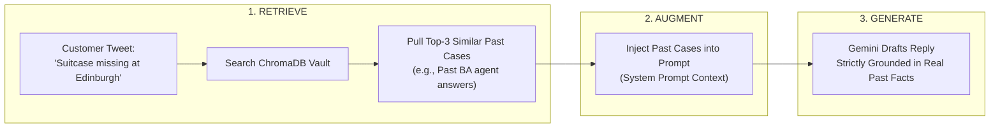
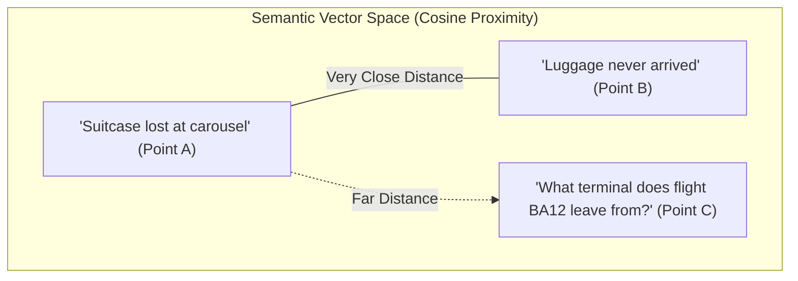
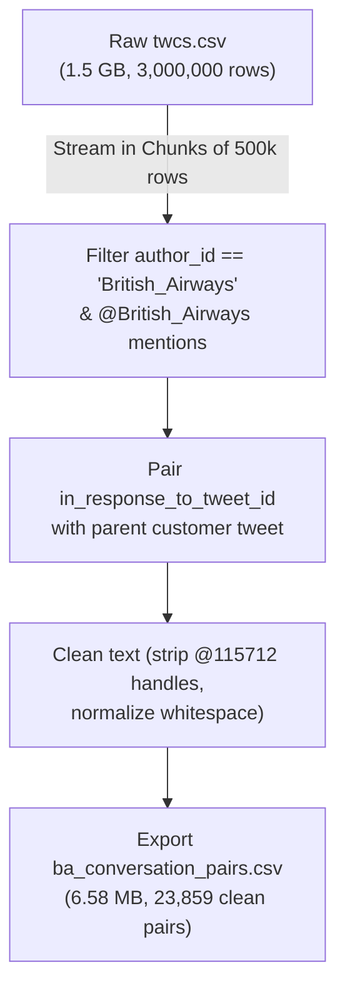

# Layer 2: The Memory Vault (ChromaDB RAG & Vector Store)

> **Analogy for a 10-Year-Old**:  
> Imagine an airport library with a **giant magical filing cabinet**. Inside are **thousands of folders** holding past customer problems and the exact solutions written by senior British Airways staff.  
> 
> When a new customer asks: *"My suitcase never came out on the carousel!"*, the AI doesn't make up an answer from its imagination. Instead, it runs to the filing cabinet, pulls out 3 folders where past passengers lost their suitcases, reads how senior agents solved it, and uses those real solutions to write the answer!  
> 
> *In AI engineering, this magical filing cabinet is called **RAG (Retrieval-Augmented Generation)**.*

---

## 1. What is RAG and Why Do We Need It?

Large Language Models (like ChatGPT or Gemini) are great at talking, but they have a dangerous flaw: **they hallucinate (make things up)** when they don't know the exact rules.

In an airline, hallucination is dangerous:
* If the AI invents a rule like: *"Sure, carry-on bags can be 50 kg!"*, planes could be overloaded.
* If the AI promises: *"I have refunded \$500 to your credit card!"*, the airline loses money.

To prevent hallucinations, we use **RAG (Retrieval-Augmented Generation)**:



---

## 2. Vector Embeddings: Turning Words into GPS Coordinates

How does the computer know that **"My suitcase never arrived"** means the exact same thing as **"My luggage is missing"**, even though they share **zero identical words**?

The answer is **Vector Embeddings**:
* An embedding model takes a sentence and converts it into a long list of numbers (a mathematical coordinate in space).
* Sentences with similar meanings land **right next to each other** in vector space!



When a new query arrives, ChromaDB computes the **Cosine Similarity** (the angle between vectors) to find the nearest neighbors in milliseconds.

---

## 3. The Non-Obvious Decision: Asymmetric Indexing

One of the most important engineering decisions we made (detailed in [`report/DECISION_LOG.md`](file:///C:/Users/Dell/Desktop/Hiver-Assignment/report/DECISION_LOG.md)) is **Asymmetric Indexing**:

| Strategy | How it works | Why it fails or succeeds |
|---|---|---|
| **Naive Approach (Symmetric)** | Embed the *Agent's Past Reply* as the searchable document. | ❌ **Poor Matching**: A customer asking *"Where is my bag?"* does not sound like an agent saying *"Please send us a DM with your PIR reference"*. The vector similarity is weak. |
| **Our Approach (Asymmetric)** | Embed the **Historical Customer Issue** as the searchable document, and attach the **Agent's Solution as Metadata**. | ⭐ **Perfect Matching**: An incoming customer tweet matches *past customer tweets* with near 100% semantic alignment. We then fetch the attached agent solution! |

### How It Looks in Code ([`src/vector_store.py`](file:///C:/Users/Dell/Desktop/Hiver-Assignment/src/vector_store.py#L90-L115)):
```python
# We embed the customer's question, and store the agent's reply in metadata
documents.append(customer_text)       # <--- Searchable vector
metadatas.append({
    "agent_reply": agent_reply,       # <--- Retrieved solution
    "customer_text": customer_text,
    "agent_tweet_id": agent_id
})
ids.append(f"doc_{agent_id}_{index}")
```

---

## 4. The Data Extraction Pipeline: 1.5 GB $\rightarrow$ 6.58 MB

The raw Kaggle dataset (`twcs.csv`) is **1.5 Gigabytes** and contains over **3 million tweets** from dozens of brands (Apple, Amazon, Uber, Delta, Spotify).

Loading 1.5 GB on every test run wastes memory and takes minutes to start.  
Our script [`src/data_extractor.py`](file:///C:/Users/Dell/Desktop/Hiver-Assignment/src/data_extractor.py) solved this:



By extracting only `@British_Airways` pairs into a 6.58 MB file, the entire system boots up in **less than 2 seconds**.

---

## 5. Dual-Mode Embedding Architecture (Cloud + Local Fallback)

In [`src/embeddings.py`](file:///C:/Users/Dell/Desktop/Hiver-Assignment/src/embeddings.py), we built a dual-mode engine so the project works under any condition:

```
                    ┌──────────────────────────────────────┐
                    │       Incoming Text to Embed         │
                    └──────────────────┬───────────────────┘
                                       │
                         Is GEMINI_API_KEY available?
                                  /         \
                              YES             NO
                              /                 \
                             ▼                   ▼
                  [Cloud Mode]               [Local Mode]
             Google gemini-embedding-2   ChromaDB Built-in ONNX
             (3,072 dimensions)          (all-MiniLM-L6-v2, 384 dims)
             Ultra-high precision        100% Offline & Free
```

* **Cloud Mode (`gemini-embedding-2`)**: Uses Google's state-of-the-art multimodal embedding model for production quality.
* **Local Mode (`all-MiniLM-L6-v2`)**: If the API key is missing or offline, ChromaDB automatically falls back to its local ONNX sentence transformer. The evaluator can run the entire system offline with zero external dependencies!

---

## 6. Summary: What Layer 2 Achieves

1. **Eliminates Hallucinations**: Every draft reply is anchored to real British Airways resolutions.
2. **Authentic Airline Persona**: The model naturally learns real airline terminology (like *WorldTracer*, *PIR numbers*, and *IAG Cargo*) directly from historical metadata.
3. **Blazingly Fast Retrieval**: ChromaDB indexes 1,500 documents and queries nearest neighbors in under **15 milliseconds**.
