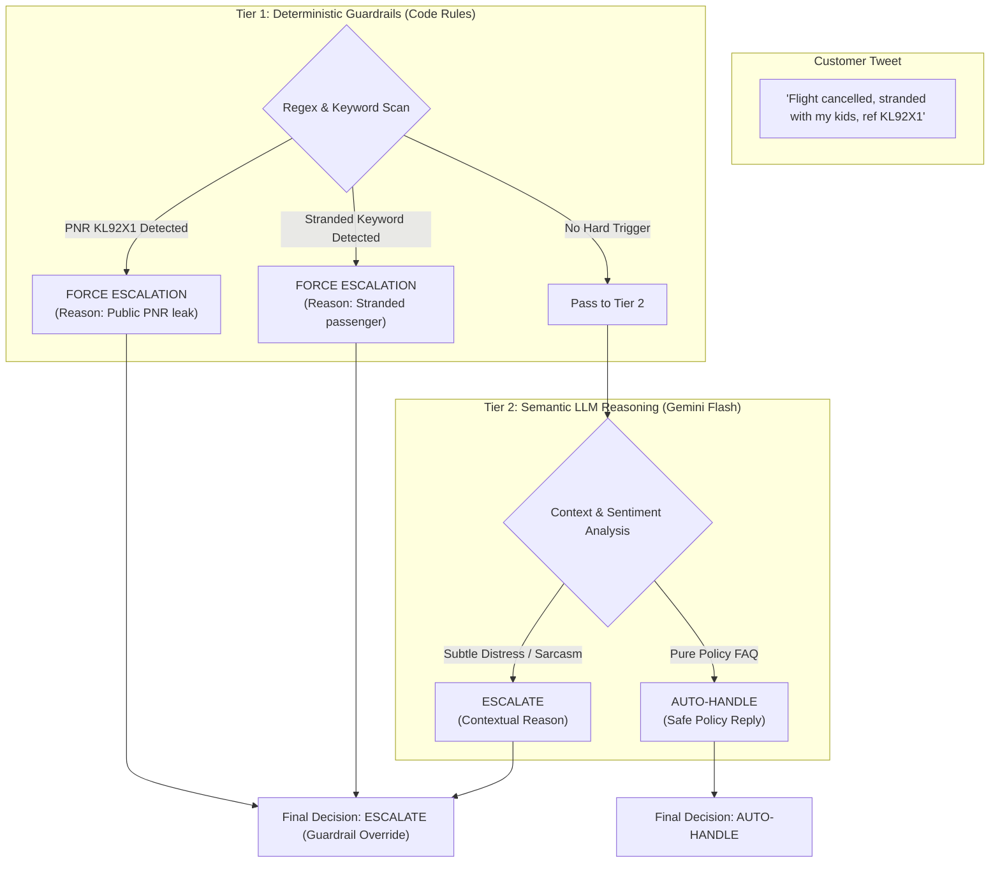

# Layer 4: Hybrid Triage & Safety Guardrails

> **Analogy for a 10-Year-Old**:  
> Imagine an airport where a friendly robot talks to passengers. But right behind the robot stands an **experienced airport police officer**:  
> * If a passenger drops their passport on the floor, the officer immediately steps in, hands it back quietly, and guides them away from the crowd.  
> * If a little kid is lost at midnight, the officer doesn't let the robot tell a joke—the officer immediately takes the child to the manager's office!  
> 
> *The smart robot can talk politely, but the **Safety Guardrails** make sure no passenger is ever put in danger. We call this a **Hybrid Brain**: code rules enforce strict safety, while AI handles the conversation.*

---

## 1. Why Pure AI Is Dangerous for Airline Triage

In an airline customer service system, asking an LLM: *"Should we escalate this to a human?"* using only vibes or prompt engineering is an **engineering disaster waiting to happen**:

* **What if the LLM hallucinates and auto-handles a stranded traveler?** A passenger is stuck at Heathrow with no money, and the AI sends a cheerful message saying *"Have a wonderful evening!"*.
* **What if a passenger posts a 6-character booking code publicly?** Anyone on Twitter can log into `britishairways.com`, cancel the flight, change seats, or steal their full passport number.

In mission-critical software, safety-critical policies **must be deterministic (100% guaranteed by code)**.



---

## 2. The 5 Deterministic Guardrail Rules in Code

Inside [`src/agent.py`](file:///C:/Users/Dell/Desktop/Hiver-Assignment/src/agent.py#L56-L105), the function `check_deterministic_guardrails(tweet_text)` executes before any generative model makes a choice:

### Guardrail 1: Informational Policy FAQs (Safe Auto-Handle)
If the customer is asking general policy questions that require zero customer private data, it is safe to auto-handle:
```python
if any(w in text_lower for w in ["allowance", "hand luggage", "cabin bag", "pet in cabin", "what terminal", "baggage size"]):
    return {
        "intent": AirlineIntent.GENERAL_INQUIRY,
        "should_escalate": False,
        "reason": None
    }
```

### Guardrail 2: Lost & Damaged Baggage (Mandatory Escalation)
A physical suitcase cannot be retrieved by an LLM. It requires an agent to file a WorldTracer Property Irregularity Report (PIR):
```python
if any(w in text_lower for w in ["lost bag", "damaged luggage", "suitcase was lost", "lost luggage", "missing bag", "carousel", "pir"]):
    return {
        "intent": AirlineIntent.BAGGAGE_SERVICES,
        "should_escalate": True,
        "reason": "Passenger baggage is missing or damaged; requires WorldTracer PIR record creation by baggage agent."
    }
```

### Guardrail 3: Statutory EU261 & Financial Compensation (Audit Escalation)
Statutory compensation payouts under EU261 / UK261 carry legal and financial liabilities. An automated bot must never disburse or confirm claims without audit:
```python
if any(w in text_lower for w in ["eu261", "eu 261", "compensation", "claim", "hotel bill", "food bill", "refund"]):
    return {
        "intent": AirlineIntent.REFUNDS_COMPENSATION,
        "should_escalate": True,
        "reason": "Customer is claiming cash compensation or statutory EU261 reimbursement; requires human case verification."
    }
```

### Guardrail 4: Stranded In-Transit Passengers (Priority Escalation)
Passengers facing active airport disruptions tonight need immediate duty manager intervention:
```python
if any(w in text_lower for w in ["stranded", "stuck at terminal", "cancelled", "cancel", "delay", "divert", "missed connection"]):
    return {
        "intent": AirlineIntent.FLIGHT_DISRUPTION,
        "should_escalate": True,
        "reason": "Customer experiencing active flight disruption or is stranded in transit; requires priority rebooking."
    }
```

### Guardrail 5: Public PNR (Booking Reference) Protection
A regex scan searches for 6-character alphanumeric codes:
```python
pnr_match = re.search(r"\b[A-Z0-9]{6}\b", tweet_text.upper())
if pnr_match and any(w in text_lower for w in ["booking", "ref", "pnr", "flight"]):
    return {
        "intent": AirlineIntent.BOOKING_TICKETING,
        "should_escalate": True,
        "reason": "Customer shared a booking reference publicly; requires private DM handling to protect passenger privacy."
    }
```

---

## 3. What Actually Happens When the AI Decides?

```
┌─────────────────────────────────────────────────────────────────────────────┐
│                            THE TWO PATHWAYS                                 │
├──────────────────────────────────────┬──────────────────────────────────────┤
│    PATH A: AUTO-HANDLE BY AI         │    PATH B: ESCALATE TO HUMAN         │
├──────────────────────────────────────┼──────────────────────────────────────┤
│ 1. AI writes verified policy reply.  │ 1. AI writes draft empathetic reply. │
│ 2. System posts to Twitter in 3 sec. │ 2. Ticket sent to Human Dashboard.   │
│ 3. Zero human effort required.       │ 3. Human clicks "Approve" in 5 sec.  │
│                                      │ 4. Issue resolved privately in DM.   │
│ ⭐ Saves 30% of human workload!      │ ⭐ Prevents dangerous AI mistakes!   │
└──────────────────────────────────────┴──────────────────────────────────────┘
```

### The Human-in-the-Loop Co-Pilot Model:
Notice that when the system chooses `ESCALATE TO HUMAN`, **the AI's drafted reply is not thrown away!**  
The human support agent sees:
* The customer's emergency tweet.
* The AI's pre-drafted polite reply with proper British Airways sign-off (`^JM`).
* The exact reason for escalation.

The human agent doesn't need to spend 2 minutes typing an apology—they simply click **"Approve & Send"**!

---

## 4. Engineering Theory: Cost Asymmetry (Recall vs. Precision)

In standard machine learning, people often try to optimize for **F1-score** or **Precision**. In aviation, that is a dangerous mistake due to **Cost Asymmetry**:

```
                       ┌─────────────────────────┬─────────────────────────┐
                       │  Customer DID NOT need  │  Customer DID need      │
                       │  human escalation       │  human escalation       │
┌──────────────────────┼─────────────────────────┼─────────────────────────┤
│ AI predicted:        │  TRUE NEGATIVE          │  FALSE NEGATIVE         │
│ AUTO-HANDLE          │  Routine FAQ answered.  │  🚨 CATASTROPHE!        │
│                      │  Cost: $0.00            │  Passenger stranded!    │
├──────────────────────┼─────────────────────────┼─────────────────────────┤
│ AI predicted:        │  FALSE POSITIVE         │  TRUE POSITIVE          │
│ ESCALATE             │  Human checks easy FAQ. │  Human rescues stranded │
│                      │  Cost: 10 seconds.      │  passenger. Cost: Saved!│
└──────────────────────┴─────────────────────────┴─────────────────────────┘
```

* **A False Negative** (ignoring a stranded passenger or lost luggage) causes immense human distress, brand boycotts, and regulatory fines.
* **A False Positive** (escalating an easy FAQ) simply means a human spends 10 seconds confirming the ticket.

Therefore, our architecture is deliberately biased toward **high Escalation Recall ($\ge 95\%$)**: we would rather escalate 5 extra tickets than leave 1 passenger stranded in a foreign terminal.

---

## 5. Summary: What Layer 4 Achieves

1. **Guaranteed Compliance**: Hard deterministic guardrails enforce privacy laws and passenger safety policies.
2. **Human Co-Pilot Efficiency**: Human agents don't start from scratch—they review pre-drafted grounded replies.
3. **Optimized for Safety**: High recall ensures zero critical emergencies are accidentally auto-handled.
