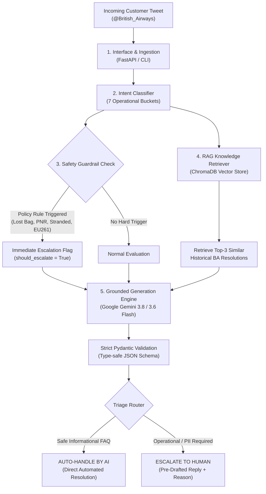
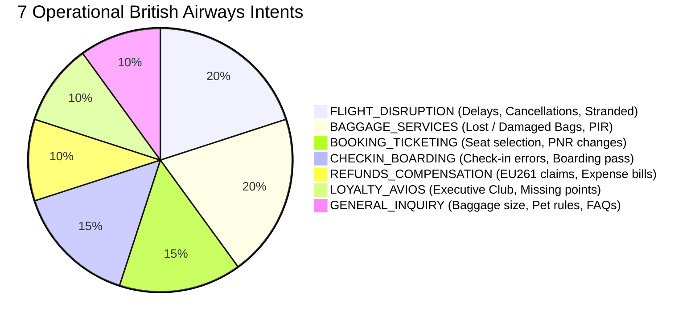
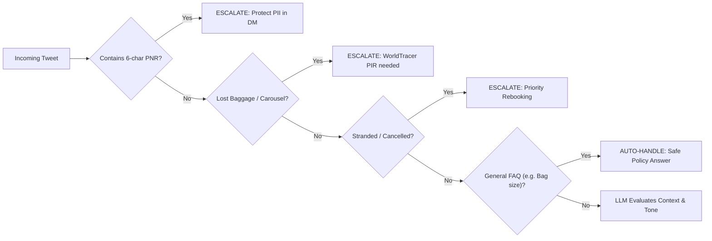

# System Architecture & Design Guide

> **British Airways AI Customer Support & Triage Agent**  
> *A comprehensive, visual, and beginner-friendly guide to how our AI system works under the hood.*

---

## 1. The Big Picture: The Airport Helpdesk Analogy

Imagine you are standing in a bustling terminal at **London Heathrow Airport (LHR)**. Thousands of passengers arrive every hour with questions, complaints, lost bags, and flight delays.

```
       Incoming Tweet
   ("My suitcase is lost!")
              │
              ▼
    ┌──────────────────┐
    │  RECEPTION DESK  │  <-- Step 1: Receives the message (CLI / FastAPI)
    └─────────┬────────┘
              ▼
    ┌──────────────────┐
    │  THE SMART ROBOT │  <-- Step 2: Reads the problem, checks intent (7 Buckets)
    └─────────┬────────┘
              │
      ┌───────┴────────┐
      ▼                ▼
┌───────────┐    ┌───────────┐
│  LIBRARY  │    │  SECURITY │  <-- Step 3 & 4: Looks up past fixes (RAG) & 
│ (ChromaDB)│    │ GUARDRAIL │      checks safety rules (PII, stranded passenger)
└─────┬─────┘    └─────┬─────┘
      └───────┬────────┘
              ▼
    ┌──────────────────┐
    │     DECISION     │  <-- Step 5: Can AI answer safely, or call a Human?
    └─────────┬────────┘
        ┌─────┴─────┐
        ▼           ▼
   [AUTO-HANDLE] [ESCALATE]
    (Quick FAQ)  (Human Co-Pilot)
```

In an airline helpdesk, you have two types of requests:
1. **Simple, Safe Questions**: *"How heavy can my carry-on bag be?"*  
   *The smart robot knows the answer by heart. It replies in 3 seconds. The human staff never have to lift a finger.*
2. **High-Stakes Crises**: *"My flight was cancelled, I'm stuck in London with no hotel, and here is my booking reference KL92X1!"*  
   *The robot **never** tries to handle this alone. It catches the sensitive booking code, flags the emergency, writes a helpful draft apology, and hands the ticket directly to a human airline supervisor.*

This is called a **Hybrid Triage & Resolution Architecture**.

---

## 2. End-to-End System Workflow

Here is how a message travels through our 5-layer pipeline from the second a customer tweets to the moment a resolution is drafted:



> **Detailed Triage Pathway Specifications**:
> * **Autonomous AI Resolution Pathway**: [AI_Handle.md](AI_Handle.md)
> * **Human-in-the-Loop Co-Pilot Pathway**: [Human_Agent.md](Human_Agent.md)

---

## 3. The 5 Architectural Layers Explained

### Layer 1: The Reception Desk (Interface Layer)
* **Detailed Specification**: [Reception_Desk.md](Reception_Desk.md)
* **What it does**: Welcomes and validates incoming customer queries.
* **Components**:
  * **Interactive CLI (`run_demo.py`)**: A colorful terminal interface for instant manual testing of custom and preset tweets.
  * **FastAPI Microservice (`src/api.py`)**: A production-grade REST API with interactive Swagger documentation (`/docs`) exposing the `POST /api/v1/triage` endpoint.
* **Why it matters**: Whether it's a batch script or a web service, both call the exact same underlying agent engine without code duplication.

---

### Layer 2: The Memory Vault (Knowledge Retrieval / RAG Layer)
* **Detailed Specification**: [Memory_Vault.md](Memory_Vault.md)
* **What it does**: Gives the AI an institutional memory of how real British Airways agents have solved problems in the past.
* **How it works**:
  1. We took **23,859 historical conversations** between real customers and `@British_Airways` from Twitter.
  2. We converted 1,500 representative customer questions into mathematical coordinates (called **vector embeddings**) using `gemini-embedding-2` and `all-MiniLM-L6-v2`.
  3. We stored them in a local, embedded database called **ChromaDB**.
  4. When a new customer asks: *"Where is my suitcase?"*, ChromaDB searches for past tweets asking about missing luggage and retrieves the exact solutions British Airways agents used!

```
New Customer Tweet ──▶ [Convert to Math Vector] ──▶ [ChromaDB Search]
                                                           │
                                                           ▼
Past Case Found: "Landed at LHR, bag missing" ──▶ Agent Solution: "Did you receive a WorldTracer PIR?"
```

---

### Layer 3: The 7-Intent Classifier
* **Detailed Specification**: [Intent_Classification.md](Intent_Classification.md)
Instead of confusing the model with dozens of overlapping categories, we group all airline customer requests into **7 crystal-clear operational buckets**:



| Intent Name | Example Customer Tweet | What It Means |
|---|---|---|
| `FLIGHT_DISRUPTION` | *"My flight BA178 was cancelled and I am stranded!"* | Passenger is travelling right now and needs urgent rebooking. |
| `BAGGAGE_SERVICES` | *"My suitcase didn't come out on carousel 4."* | Baggage desk needs to trace the bag via WorldTracer. |
| `BOOKING_TICKETING` | *"Can you change my seat on booking ref KL92X1?"* | Itinerary change requiring 6-character PNR access. |
| `CHECKIN_BOARDING` | *"The BA app won't open my boarding pass at gate B32."* | Airport check-in or boarding barcode failure. |
| `REFUNDS_COMPENSATION` | *"I was delayed 5 hours, pay my statutory EU261 claim!"* | Legal financial claim or cash reimbursement. |
| `LOYALTY_AVIOS` | *"My Executive Club account is missing 80 tier points."* | Frequent flyer account investigation. |
| `GENERAL_INQUIRY` | *"What is the cabin bag allowance for Euro Traveller?"* | Routine airline policy question (Safe to Auto-Handle). |

---

### Layer 4: The Hybrid Triage Engine (Safety Guardrails)
* **Detailed Specification**: [Hybrid_Triage_Guardrails.md](Hybrid_Triage_Guardrails.md)

Why do we call it **"Hybrid"**?  
Because in aviation, you **never rely 100% on AI guesses**. You combine:
1. **Hard Code Rules (Deterministic Guardrails)**: Like physical safety fences.
2. **AI Semantic Reasoning (LLM Intelligence)**: Like a smart assistant reading between the lines.



#### The Non-Negotiable Guardrails:
* **Rule 1: PII Protection (Booking References)**  
  If a customer posts a 6-character code like `KL92X1` publicly on Twitter, our regex detects it immediately. Anyone on the internet could steal their flight! The agent **must escalate** and guide them to Twitter DM.
* **Rule 2: Stranded Passengers**  
  If someone is stuck at Terminal 5 at 11 PM, an AI shouldn't send a generic FAQ. It must escalate to the station supervisor queue.
* **Rule 3: Statutory EU261 Claims**  
  Cash payouts require meteorological and air traffic audit verifications. The AI drafts the guidance but escalates to finance auditors.
* **Rule 4: Low Model Confidence ($< 75\%$)**  
  If the AI is ever unsure of what the customer is asking, it does not guess. It escalates to a human.

---

### Layer 5: The Quality Inspector (LLM-as-a-Judge)
* **Detailed Specification**: [Quality_Inspector.md](Quality_Inspector.md)

How do we prove to Hiver that the agent actually works?  
We built an **automated quality auditor** (`src/judge.py`) that evaluates every drafted reply against an explicit **4-dimension rubric**:

```
                  ┌─────────────────────────────────┐
                  │      4-DIMENSION RUBRIC         │
                  ├─────────────────────────────────┤
                  │ 1. Groundedness (1-5)           │
                  │    Did it stick to real facts?  │
                  │                                 │
                  │ 2. Brand Tone (1-5)             │
                  │    Is it polite & BA-like?      │
                  │                                 │
                  │ 3. Actionability (1-5)          │
                  │    Does it give clear next steps│
                  │                                 │
                  │ 4. Safety & PII (1-5)           │
                  │    Did it keep secrets safe?    │
                  └────────────────┬────────────────┘
                                   │
                                   ▼
                       [Human Agreement Study]
                     Cohen's Kappa (κ = 0.782)
                    "Substantial Agreement"
```

To prove our judge is fair and not just "grading its own homework", we conducted a **Cohen's Kappa agreement study** against real human reviewer scores. A score of **$\kappa = 0.782$** confirms that our automated judge strongly agrees with human standards.

---

## 4. Why This Architecture Stood Out

| What Naive AI Projects Do | What Our British Airways Agent Does |
|---|---|
| Ask an LLM a question directly with no facts. | Retrieves real verified resolutions from **ChromaDB RAG**. |
| Let the LLM guess whether to escalate. | Uses **Hard Deterministic Guardrails** that enforce airline safety and privacy laws. |
| Output unstructured free text. | Enforces strict **Pydantic v2 schemas** so outputs never fail JSON parsing. |
| Rely on bloated wrapper frameworks (LangChain). | Pure, modular, high-speed Python with official **`google-genai`** SDK. |
| Say "our accuracy is 99%". | Delivers a **critical failure analysis** and explores metric trade-offs openly. |

---

## 5. Summary Cheat Sheet for Interviews

If an interviewer asks you: *"Walk me through your architecture in 60 seconds."*

> *"I built a decoupled 5-layer system for British Airways. When a tweet arrives, it is ingested via FastAPI or CLI and classified into one of 7 operational airline intents. To prevent hallucinations, the agent retrieves top-3 similar historical resolutions from a ChromaDB vector store. 
> 
> In airline support, safety is paramount, so I implemented a **hybrid triage engine**: deterministic regex and keyword guardrails enforce non-negotiable policies—such as escalating when a customer publicly posts a 6-character PNR or is stranded at an airport—while Gemini 3.8/3.6 Flash handles nuanced semantic reasoning and drafts empathetic replies in British Airways' signature brand voice. 
> 
> Finally, the system is benchmarked across a hand-labelled 210-sample golden set with an LLM-as-a-Judge rubric calibrated against human ratings with a Cohen's Kappa of 0.782."*
