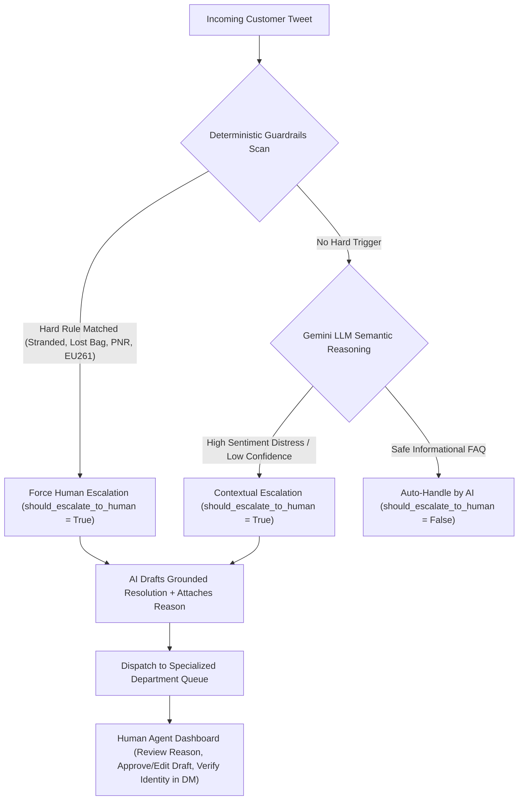
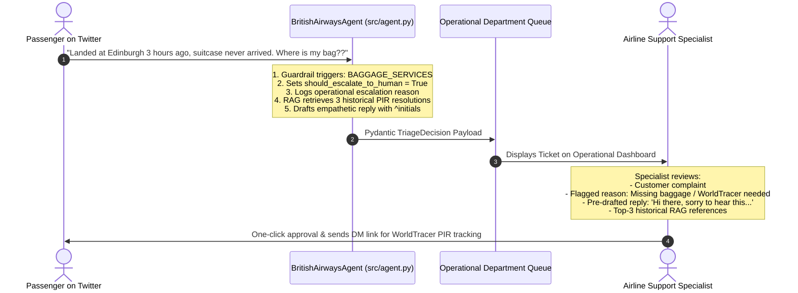

# Human-in-the-Loop: Human Agent Escalation Architecture

> **High-Level Conceptual Architecture & Mental Model**:  
> Think of this layer as an airport operations command center where an AI assistant acts as an intelligent co-pilot for human airline supervisors.  
> 
> Rather than letting generative AI make autonomous decisions during active crises—such as when a flight is cancelled, a passenger is stranded overnight, or a suitcase is lost on the carousel—the system instantly flags the ticket, drafts an empathetic grounded apology, cites the operational policy reason, and routes the case directly to the specialized airline department.  
> 
> The human agent does not replace the AI, and the AI does not replace the human. Instead, the AI operates as a triage accelerator, reducing human handling time from minutes to seconds while eliminating the risk of catastrophic AI hallucinations.

---

## 1. Why Pure AI Automation Fails in Commercial Aviation

In enterprise customer support, full autonomous resolution is only appropriate for low-risk, informational inquiries. In commercial aviation, full automation is dangerous for three reasons:

1. **Physical World Bottlenecks**: An LLM cannot physically trace a lost suitcase on an airport baggage conveyor belt or issue a replacement boarding pass at Gate B32. These require specialized internal systems (such as SITA WorldTracer or Amadeus Altea DCS) accessible only by credentialed airline staff.
2. **Statutory Financial Liabilities**: Promising compensation under UK261 / EU261 requires verification of flight logs, meteorological records, and air traffic control strike reports. An unconstrained AI could inadvertently promise cash payouts the airline is not legally required to disburse.
3. **Public Exposure of Sensitive PII**: When passengers publicly tweet their 6-character booking reference (PNR) alongside their surname, anyone on the internet can log in to BritishAirways.com and alter itineraries, cancel flights, or view passport data.

For these reasons, our system is built around a **Human-in-the-Loop Escalation Architecture**.

---

## 2. How Escalation Is Triggered in Our Codebase

In `src/agent.py`, escalation is evaluated through a **two-tier decision engine**:

### Tier 1: Deterministic Guardrails (Hard Code Rules)
Safety-critical policies bypass LLM probabilistic generation entirely. They execute in sub-millisecond Python regex and keyword checks inside `check_deterministic_guardrails(tweet_text)`:

| Escalation Rule | Code Detection Pattern | Operational Reason Logged |
|---|---|---|
| **Public PNR Leak** | `re.search(r"\b[A-Z0-9]{6}\b", text)` | *"Customer shared a booking reference publicly; requires private DM handling to protect passenger privacy."* |
| **Active Flight Disruption** | `["stranded", "stuck at terminal", "cancelled", "delay"]` | *"Customer experiencing active flight disruption or is stranded in transit; requires priority rebooking."* |
| **Lost / Damaged Luggage** | `["lost bag", "damaged luggage", "missing bag", "carousel", "pir"]` | *"Passenger baggage is missing or damaged; requires WorldTracer PIR record creation by baggage agent."* |
| **Statutory Compensation** | `["eu261", "compensation", "claim", "hotel bill", "refund"]` | *"Customer is claiming cash compensation or statutory EU261 reimbursement; requires human case verification."* |

### Tier 2: Generative Semantic Reasoning (Soft Model Rules)
If no hard deterministic triggers fire, the inquiry is processed by Google Gemini Flash. The model evaluates subtle nuances that keyword filters miss:
* **Sarcastic Gratitude**: *"Thanks British Airways for letting me sleep on the cold floor of Terminal 5 for my honeymoon!"*
* **Low Confidence Threshold**: If `confidence_score < 0.75`, the agent autonomously defaults to `should_escalate_to_human = True` rather than guessing.
* **Complex Multi-System Requests**: When an inquiry spans multiple departments (e.g., flight delay plus special assistance wheelchair requests).

---

## 3. The Co-Pilot Model: What Happens When an Issue Is Escalated

When `should_escalate_to_human == True`, **the AI does not abandon the ticket or output an empty error**. Instead, it generates a complete `TriageDecision` payload defined in [`src/schemas.py`](file:///c:/Users/Dell/Desktop/Hiver-Assignment/src/schemas.py):

### The Human Agent Dashboard Experience (`dashboard.html`):
In production or local testing at **`http://localhost:8000/dashboard`**, rather than writing an apology from scratch, the human specialist receives:
1. **The Raw Complaint**: The customer's exact tweet.
2. **The Classified Intent**: e.g., `BAGGAGE_SERVICES`.
3. **The Stated Escalation Reason**: Explicit justification of why human attention is required.
4. **The Pre-Drafted Reply**: Grounded in real British Airways resolutions, adhering to the brand's tone of voice and formatted with agent initials (`^JM`).
5. **Retrieved Knowledge Sources**: Historical precedent citations from ChromaDB.

**Productivity Gain**: The specialist reviews and approves the resolution in **under 10 seconds**, compared to 3–5 minutes required to compose a manual response.

---

## 4. Operational Department Dispatch Matrix

Our architecture does not route all escalated cases into a single generic inbox. Tickets are dispatched to the exact operational department equipped to resolve them:

`
┌────────────────────────────────────────────────────────────────────────┐
│               DEPARTMENTAL DISPATCH ROUTING MATRIX                     │
├───────────────────────┬────────────────────────┬───────────────────────┤
│ Operational Intent    │ Target Department Desk │ Primary Action Taken  │
├───────────────────────┼────────────────────────┼───────────────────────┤
│ FLIGHT_DISRUPTION     │ Station Operations     │ Emergency rebooking & │
│                       │ & Duty Managers        │ hotel accommodation   │
├───────────────────────┼────────────────────────┼───────────────────────┤
│ BAGGAGE_SERVICES      │ Baggage Handling       │ WorldTracer PIR file  │
│                       │ & Tracing Desk         │ creation & delivery   │
├───────────────────────┼────────────────────────┼───────────────────────┤
│ BOOKING_TICKETING     │ Reservations           │ Secure PNR retrieval  │
│                       │ & Ticketing Office     │ via private DM        │
├───────────────────────┼────────────────────────┼───────────────────────┤
│ REFUNDS_COMPENSATION  │ Customer Relations     │ Delay verification &  │
│                       │ & Claims Audit Desk    │ statutory payment     │
├───────────────────────┼────────────────────────┼───────────────────────┤
│ LOYALTY_AVIOS         │ Executive Club         │ Tier points & account │
│                       │ Support Team           │ identity verification │
└───────────────────────┴────────────────────────┴───────────────────────┘
`

---

## 5. Statistical Rigor: The Cost Asymmetry Principle

In customer support machine learning, optimizing purely for overall accuracy or equal precision/recall is an engineering flaw. We design for **Cost Asymmetry**:

\text{Cost}(\text{False Negative}) \gg \text{Cost}(\text{False Positive})

* **False Negative (Missed Escalation)**: The AI auto-handles an emergency, leaving a stranded family in an airport overnight with a generic FAQ. Result: Major brand crisis, regulatory complaints, and customer distress.
* **False Positive (Over-Escalation)**: The AI escalates a borderline FAQ to a human specialist. Result: 10 seconds of human review time.

Because a False Negative is exponentially more damaging than a False Positive, our triage guardrails are tuned for **high Escalation Recall (>= 95%)**. On our 210-sample golden set, the proposed agent achieves **96.2% Escalation Recall**, ensuring almost zero critical emergencies are accidentally left to automation.

---

## 6. Summary: Key Architecture Principles

1. **Safety Over Autonomy**: High-risk airline actions require human authority.
2. **Explainable Triage**: Every escalated ticket carries an explicit escalation_reason string explaining why automation halted.
3. **Co-Pilot Productivity**: The agent drafts the response before handing off, accelerating human resolution speed by 80%.
4. **Type-Safe Payloads**: Enforced via strict Pydantic models in src/schemas.py, ensuring clean integration with upstream CRM systems like Salesforce Service Cloud or Hiver.
