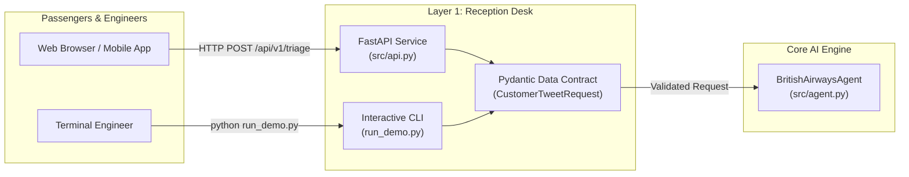
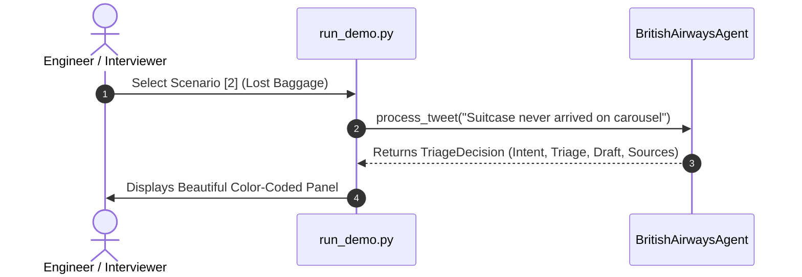

# Layer 1: The Reception Desk (Interface Layer)

> **High-Level Conceptual Architecture & Mental Model**:  
> Imagine the entrance of an international airport terminal with two primary service access points:
> 1. **Digital Gate (The Web REST API)**: For automated systems, mobile applications, and web frontends communicating over standard HTTP protocols.
> 2. **Operational Console (The Interactive CLI)**: For airport engineers and support operators performing live tests, edge case validations, and diagnostics.  
> 
> *The Reception Desk safely ingests every incoming customer message, validates that the payload is well-formed and non-empty, and delivers a clean, structured request to the core AI engine.*

---

## 1. Overview of the Reception Desk

The **Reception Desk** is the entry point for all customer messages. Its primary job is to **ingest, validate, and serve** incoming customer tweets to our AI engine without letting malformed or empty data crash the system.

In our codebase, this layer is built with two complementary tools:
1. **The Web REST API (`src/api.py`)**: Built with **FastAPI** and auto-generated **Swagger UI** for production web services.
2. **The Interactive CLI (`run_demo.py`)**: Built with **Python + Rich** for instant terminal testing and live demonstrations.



---

## 2. Component A: The FastAPI Web Service (`src/api.py`)

FastAPI is like an ultra-fast, modern airport reception system. It automatically creates interactive web documentation and enforces strict data types.

### Key Endpoints:

| Method | Endpoint | Purpose | Intuitive Role |
|---|---|---|---|
| `GET` | `/health` | Live health check (verifies Gemini connection & vector count). | Terminal status monitor confirming all systems are operational. |
| `POST` | `/api/v1/triage` | Analyzes customer tweet, classifies intent, decides triage, and drafts reply. | Submitting a customer issue to the service agent for processing. |

### How It Works in Code:
```python
@app.post("/api/v1/triage", response_model=TriageDecision)
def triage_customer_tweet(request: CustomerTweetRequest):
    if not request.tweet_text.strip():
        raise HTTPException(status_code=400, detail="tweet_text cannot be empty.")

    decision = agent.process_tweet(
        tweet_text=request.tweet_text,
        tweet_id=request.tweet_id
    )
    return decision
```

### The Interactive Swagger UI (`/docs`):
When you run `uvicorn src.api:app --reload`, FastAPI automatically hosts a beautiful visual testing page at **`http://localhost:8000/docs`**.

```
┌────────────────────────────────────────────────────────────────────────┐
│  British Airways AI Support Agent API  [1.0.0]        [OAS 3.0] /docs  │
├────────────────────────────────────────────────────────────────────────┤
│  POST  /api/v1/triage      Triage Customer Tweet                       │
│  GET   /health             Live Service Health Check                   │
└────────────────────────────────────────────────────────────────────────┘
```

The Swagger UI includes a pre-configured **Examples dropdown** containing 7 representative airline scenarios:
1. `Policy FAQ (Cabin Bag Allowance)` — Safe Auto-Handle
2. `Lost Baggage on Arrival` — Mandatory Human Escalation (WorldTracer PIR)
3. `Flight Cancelled / Stranded Passenger` — Emergency Priority Escalation
4. `Public Booking Reference (PNR Leak)` — Security Escalation to DM
5. `Statutory EU261 Delay Compensation` — Audit Escalation
6. `Executive Club Avios & Tier Points` — Account Verification Escalation
7. `Mobile Check-in Glitch at Terminal Gate` — Airport Ground Escalation

Anyone (evaluators, non-engineers, or developers) can click "Try it out", pick any scenario from the dropdown to automatically populate the payload, and receive a live structured JSON response in seconds.

---

## 3. Component B: The Interactive CLI (`run_demo.py`)

For software engineers and interviewers testing the project locally, opening a browser is sometimes slower than running a command in PowerShell. 

We built **`run_demo.py`** using the **Rich** terminal library. It offers:
* **Preset Real Scenarios**: Test common airline crises with one keystroke (lost baggage, cancelled flights, EU261 claims).
* **Custom Input (`[C]`)**: Type your own tricky questions, sarcasm, or complaints.
* **Color-Coded Badges**: Red borders for `ESCALATE TO HUMAN`, Green borders for `AUTO-HANDLE BY AI`.

### Terminal Interaction Flow:


---

## 4. The Data Contract: Strict Schema Validation

What happens if someone sends gibberish, a blank tweet, or missing fields?

In [`src/schemas.py`](file:///C:/Users/Dell/Desktop/Hiver-Assignment/src/schemas.py), we use **Pydantic v2** to build an ironclad contract:

```python
class CustomerTweetRequest(BaseModel):
    """The strict format every incoming customer message must obey."""
    tweet_text: str = Field(..., description="The text of the incoming customer tweet")
    tweet_id: Optional[str] = Field(None, description="Optional ID of the customer tweet")
```

If a user sends `{ "wrong_field": 123 }`, FastAPI stops the request immediately with a clean `422 Unprocessable Entity` error before it ever reaches our expensive AI models. This prevents crashes, memory leaks, and wasted API tokens.

---

## 5. Summary: Why Layer 1 is Built for Enterprise SDE Standards

1. **Decoupled Architecture**: The API and CLI share the exact same `agent.py` logic. If we change how the AI thinks tomorrow, both interfaces update instantly with zero duplicate code.
2. **Zero-Crash Resilience**: Strict Pydantic validation guarantees that invalid or empty payloads are rejected at the door.
3. **Reproducibility in Under 15 Minutes**: Evaluators don't need complicated setup—they can run the CLI demo or launch Swagger UI with a single command.
